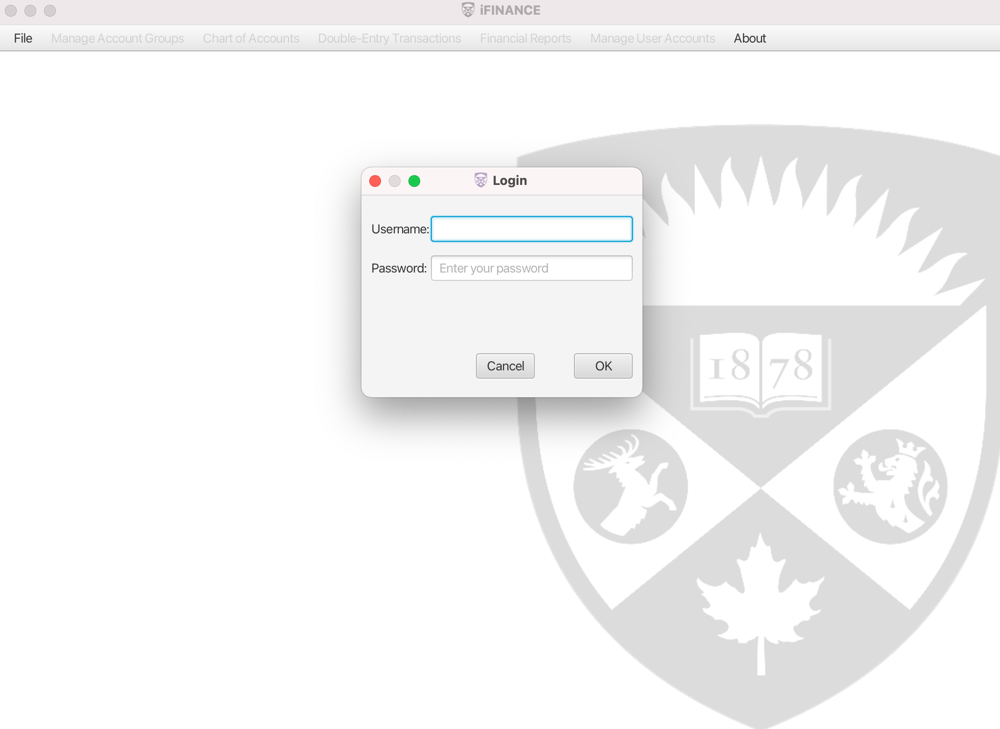
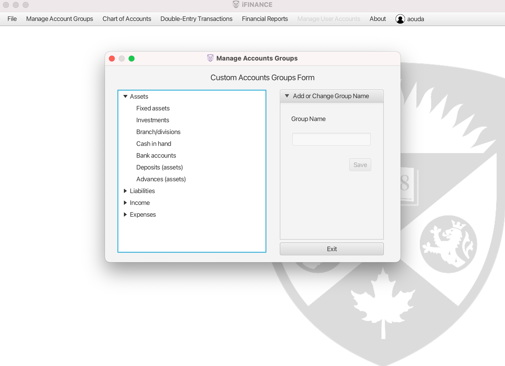
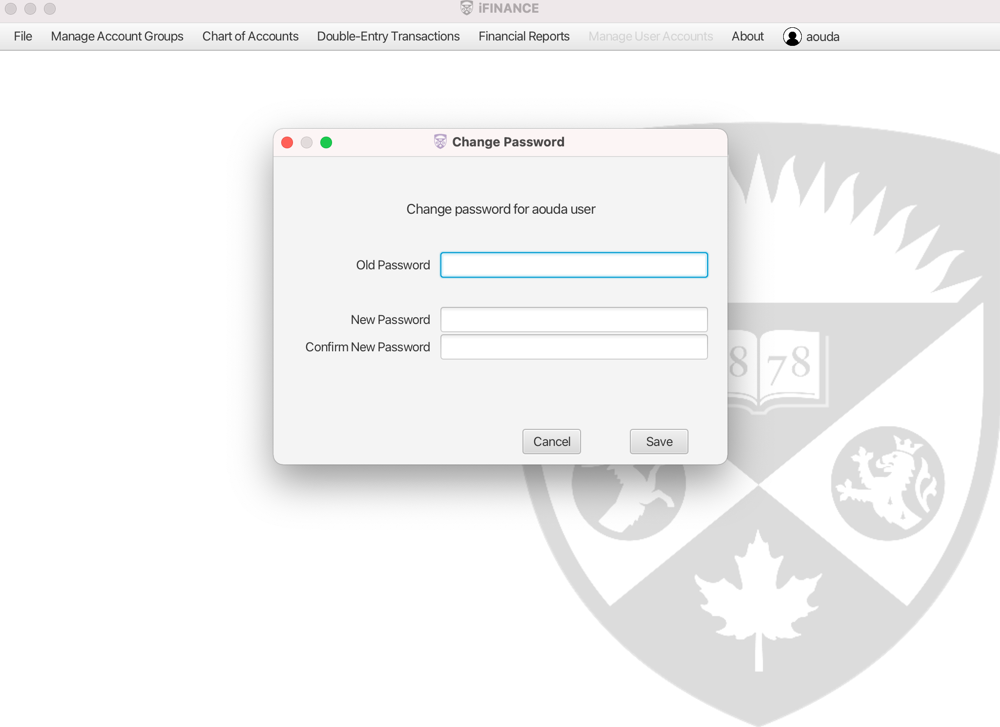
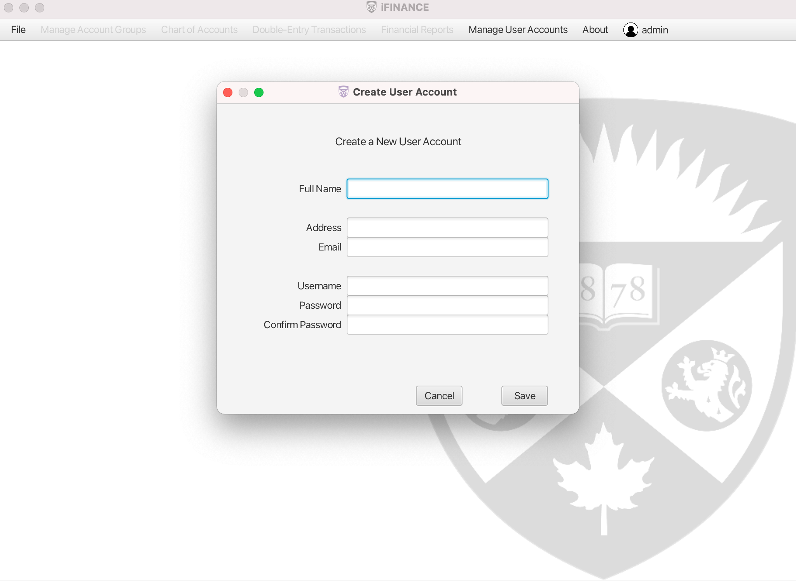
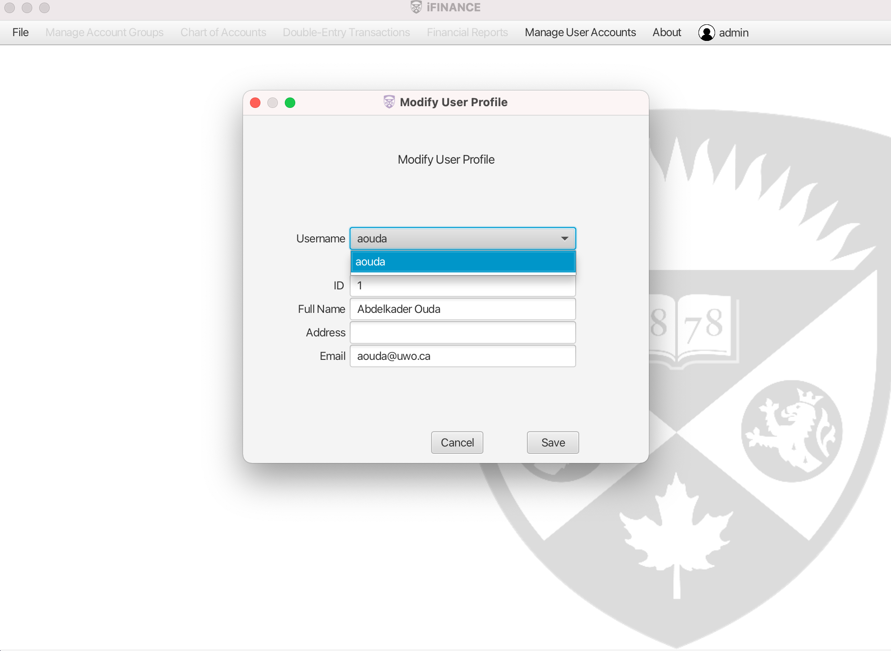
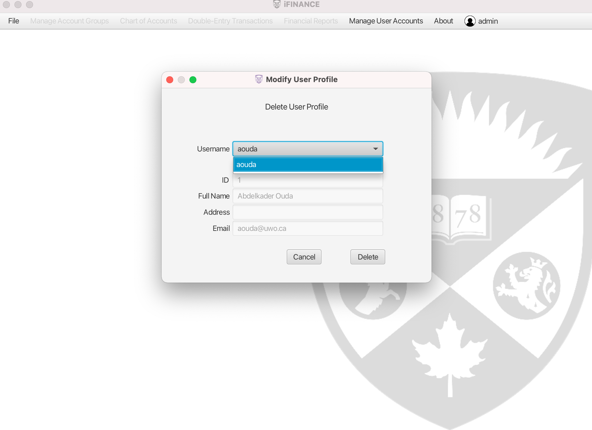

# iFinance
iFINANCE is multi-purpose Personal Finance Management tool.

iFINANCE provides a way for the users to log in using a user name and an 
encrypted password. Once the user has logged in, the access control of the
system is determined and assigned to the user to match the permissions of 
their account.

Only the system administrator has the privileges to add user accounts into the
system, edit and delete their profiles. The administrator account will be 
shipped with the system.

Each user shall have the ability to change their password.

iFINANCE maintains four predefined account categories (Assets, Liabilities, Income,
and Expenses) and two account types (Debits and Credits). Each category is either 
of type "Debit" or type "Credit."

“iFINANCE Custom Group" is a main form to be provided. This form shall allow the 
user to add, update, or delete a custom sub-categories (called Groups). This includes 
groupID, groupName, groupElement, i.e., Assets, Liabilities, Income, Expenses, and 
groupParent. Each group can be decomposed to further level of sub-groups (the 
groupParent field is responsible to maintain the parent-children link).

